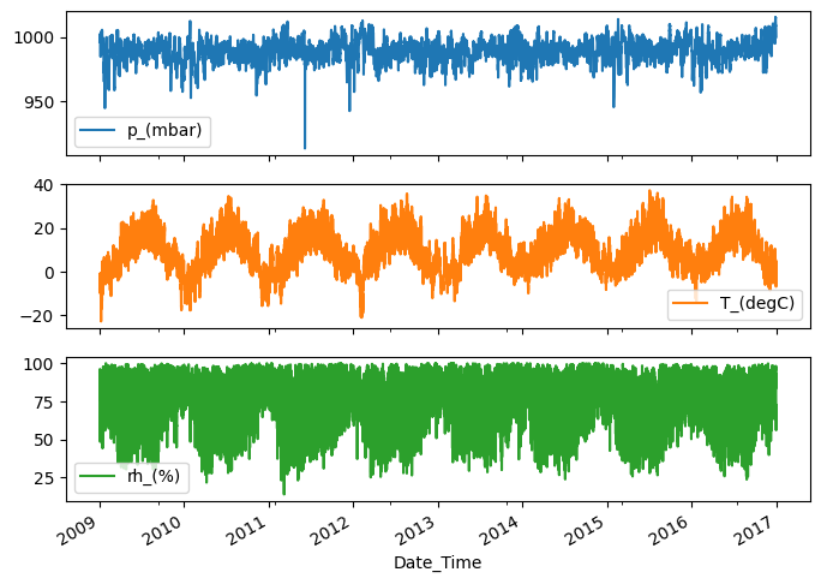
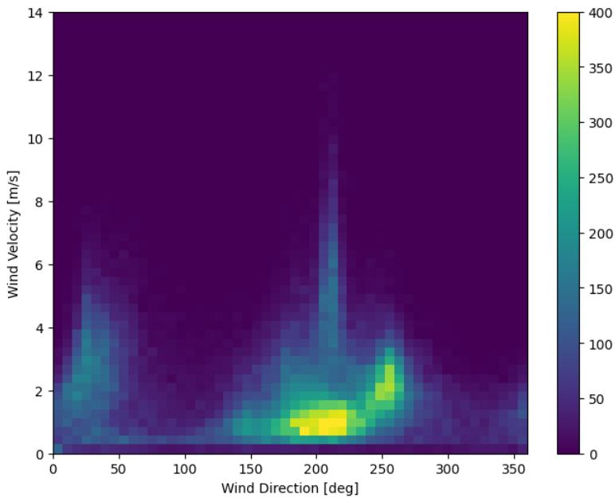
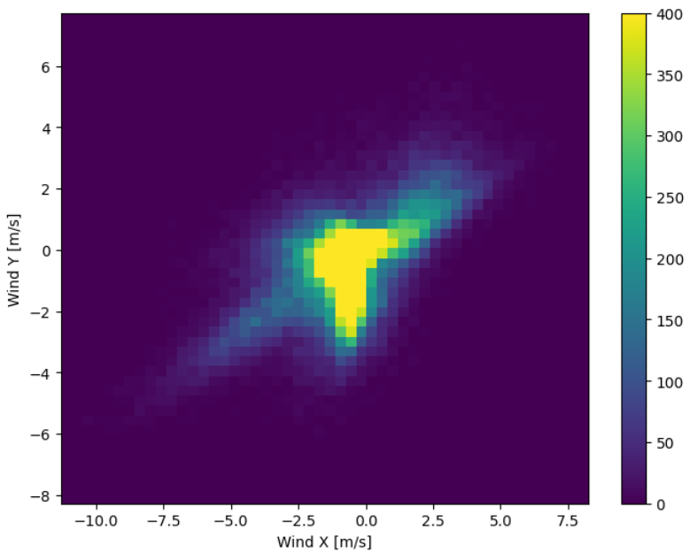
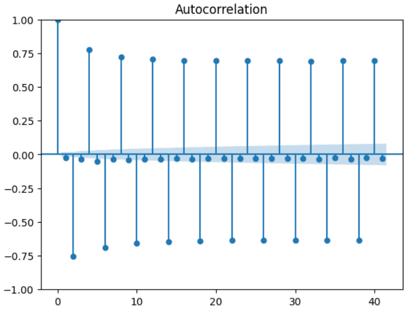
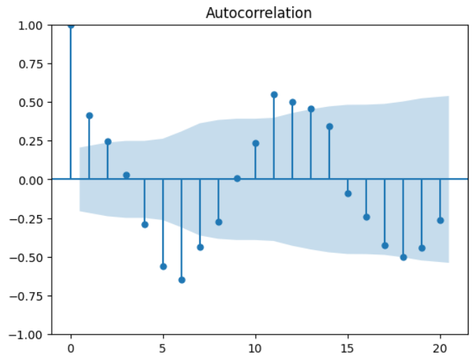
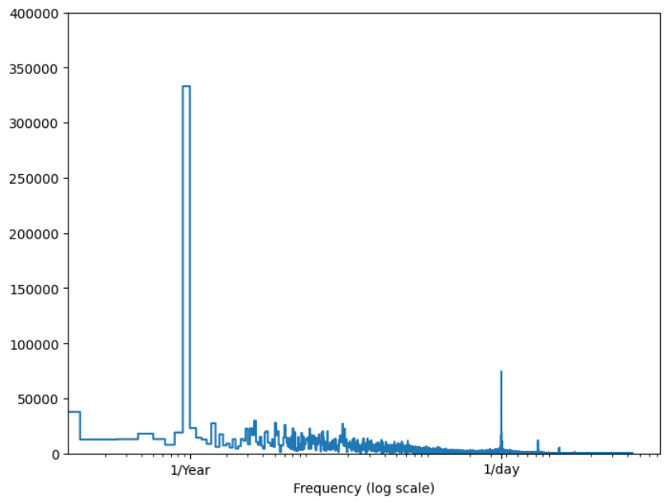

# Wetterdaten-Vorhersage mit Deep Learning und Zeitreihenanalyse

Dieses Projekt vergleicht verschiedene Modelle zur Vorhersage von Wetterdaten-Zeitreihen, darunter klassische statistische Methoden und moderne Deep-Learning-Ansätze, um die Vorhersagegenauigkeit und Effizienz der Methoden zu untersuchen.

## Inhaltsverzeichnis
1. [Einleitung](#einleitung)
2. [Verwendete Modelle](#verwendete-modelle)
3. [Datensatz und Datenvorverarbeitung](#datensatz-und-datenvorverarbeitung)
4. [Modelle und Methodik](#modelle-und-methodik)
5. [Ergebnisse](#ergebnisse)
6. [Diskussion](#diskussion)
7. [Fazit](#fazit)

## Einleitung

Wettervorhersagen basieren auf mathematischen Modellen der Atmosphäre und nutzen zunehmend Deep-Learning-Ansätze. Dieser Vergleich zielt darauf ab, verschiedene Modellarchitekturen wie LSTM und Transformer mit traditionellen Methoden wie SARIMA zu evaluieren.

## Verwendete Modelle

Die betrachteten Modelle umfassen:

- **SARIMA**: Ein klassisches Modell für stationäre Zeitreihen, das saisonale Effekte berücksichtigt.
- **LSTM**: Ein rekurrentes neuronales Netzwerk, das langfristige Abhängigkeiten lernt und ideal für sequentielle Daten ist.
- **Transformer**: Modelliert Abhängigkeiten effizient mit einem Attention-Mechanismus, was sich besonders für längere Sequenzen eignet.

## Datensatz und Datenvorverarbeitung

Der verwendete Datensatz, bereitgestellt vom Max-Planck-Institut, umfasst meteorologische Daten von 2009 bis 2016. Die Daten enthalten 14 Variablen, darunter Temperatur, Luftdruck und Windgeschwindigkeit, mit einer ursprünglichen Abtastrate von 10 Minuten. Der Datensatz wurde in stündliche Intervalle umgewandelt, und fehlerhafte Werte wurden bereinigt.

### Datenvorverarbeitungsschritte:
1. **Korrektur fehlerhafter Werte**: Werte wie -9999 bei Windgeschwindigkeit wurden auf 0.0 gesetzt.
2. **Umwandlung der Winddaten**: Windrichtung und -geschwindigkeit wurden in Vektoren umgewandelt, um Kontinuität zu gewährleisten.
    

    
    
    

3. **Normalisierung**: Die Daten wurden auf einen einheitlichen Wertebereich skaliert.

## Modelle und Methodik

### SARIMA-Modell

Das SARIMA-Modell nutzt saisonale und nicht-saisonale Parameter zur Modellierung der Zeitreihe. Der Augmented Dickey-Fuller-Test wurde zur Sicherstellung der Stationarität der Daten angewandt. Eine Vielzahl an Modellkonfigurationen wurde getestet, um die besten Parameter mittels Akaike-Informationskriterium (AIC) zu identifizieren.

    
    
    
    

### LSTM-Modell

Das LSTM-Modell besteht aus einer LSTM-Schicht und einer voll verbundenen Schicht für die Ausgabe. Die Eingabedaten wurden mit einem „WindowGenerator“ vorstrukturiert, der Eingabefenster für historische Daten und die Zielwerte für Vorhersagen erstellt.

### Transformer-Modell

Das Transformer-Modell nutzt eine Encoder-Decoder-Architektur mit einer Maskierungsfunktion, die sicherstellt, dass nur vergangene Daten zur Vorhersage herangezogen werden. Die Daten werden durch ein Sliding-Window-Verfahren strukturiert und in 16-dimensionale Embeddings überführt.

## Ergebnisse

Die Ergebnisse zeigen deutliche Unterschiede in der Genauigkeit und der Effizienz der Modelle:

- **SARIMA**: Liefert schnelle und zuverlässige Vorhersagen für stationäre Zeitreihen.
- **LSTM**: Geeignet für größere, nicht-stationäre Datensätze; benötigt jedoch mehr Zeit für das Training.
- **Transformer**: Zeigt besonders bei langen Zeitreihen hohe Genauigkeit, profitiert von Attention-Mechanismen für komplexe Muster.

## Diskussion

- **Frequenzabhängigkeit und Modellkomplexität**: Die Wahl der Datenfrequenz (z. B. 6-stündlich oder täglich) beeinflusst die Genauigkeit der Modelle. Insbesondere bei kürzeren Frequenzen zeigt SARIMA eine höhere Effizienz und erreicht gute Vorhersagegenauigkeiten mit stabilen saisonalen Mustern. Bei täglichen Daten sinkt jedoch die Genauigkeit, was auf die Schwierigkeiten hinweist, langzeitliche Abhängigkeiten zu modellieren. Transformer- und LSTM-Modelle erwiesen sich bei kurzen Frequenzen als besser geeignet.
  
- **Saisonalitätsparameter**: SARIMA-Modelle reagieren empfindlich auf die Wahl der Saisonalitätsparameter, die das Modell in einigen Fällen zu Overfitting neigen lässt, besonders wenn eine zu lange Periodizität angenommen wird. Bei der Verwendung saisonaler Komponenten mit Frequenzen von über zwölf Monaten liefern die Modelle keine zusätzlichen Erkenntnisse, da saisonale Muster jenseits eines Jahres nicht signifikant nachgewiesen wurden.

- **Input-Dimension und Modellleistung**: Für die Deep-Learning-Modelle, insbesondere Transformer, konnte durch Reduzierung der Input-Dimension eine Leistungssteigerung erzielt werden. Eine geringere Anzahl von Features führte zu einer geringeren Modellkomplexität und gleichzeitig zu verbesserten Fehlermaßen (z. B. MAE, MSE, Smape), was die Bedeutung einer sorgfältigen Feature-Auswahl bei der Modellierung unterstreicht.

- **Verlustfunktion und Modellleistung**: Bei LSTM-Modellen beeinflusst die Wahl der Verlustfunktion (MSE vs. Smape) die Modellleistung. Smape führte in den meisten Fällen zu besseren Ergebnissen, was darauf hinweist, dass die Verlustfunktion basierend auf den Vorhersagezielen und der Art der Daten sorgfältig gewählt werden sollte.

- **Regularisierung und Konzeptdrift im Transformer-Modell**: Die Anwendung von Dropout führte zu Schwankungen in den Trainingsläufen, und das Sliding-Window-Verfahren zeigte, dass unterschiedliche Positionen des Fensters verschiedene Aspekte der zugrunde liegenden Muster betonen. Ein gezieltes Preprocessing und eine bessere Regularisierung könnten diese Abweichungen reduzieren.

## Herausforderungen

Während des Projekts traten folgende Herausforderungen auf:

- **Fehlerhafte und fehlende Daten**: Daten mussten manuell korrigiert werden, um fehlerhafte Werte wie -9999 zu bereinigen. Dieser Prozess war notwendig, um die Integrität der Daten zu gewährleisten und deren Einfluss auf die Modellgenauigkeit zu minimieren.
- **Überanpassung bei Deep-Learning-Modellen**: Besonders Transformer neigten dazu, die Trainingsdaten zu überanpassen. Techniken wie Dropout und Early Stopping wurden eingesetzt, um das Modell zu regulieren.
- **Hyperparameteroptimierung**: Die Auswahl der besten Hyperparameter war zeitaufwendig und erforderte umfangreiche Tests. Insbesondere die Festlegung der Epochenzahl und die Batchgröße beeinflussten die Effizienz und Genauigkeit der Modelle.
- **Komplexität der Transformermodelle**: Die Transformer-Modelle waren speicherintensiv und erforderten spezifische Konfigurationen der Eingabedimensionen und History Size, um präzise Vorhersagen zu erzielen.
- **Berechnungskapazitäten**: Die benötigten Rechenressourcen für die Deep-Learning-Modelle waren hoch. Insbesondere Transformer und LSTM erforderten deutlich mehr Kapazität als SARIMA.

## Fazit

Die Ergebnisse dieses Projekts zeigen, dass die Wahl des Modells stark von der Art der Zeitreihe abhängt:

- **SARIMA**: Effizient für schnelle Vorhersagen bei stationären Daten.
- **LSTM**: Eignet sich für nicht-stationäre Zeitreihen und zeigt bei großen Datensätzen gute Leistungen.
- **Transformer**: Ideal für komplexe, saisonale Muster in großen Datenmengen.

## Lizenz

Dieses Projekt ist unter der MIT-Lizenz verfügbar. Weitere Details siehe [LICENSE](LICENSE).

# HOW TO

## SARIMA

Es wurden die wichtigsten Notebooks für die SARIMA-Modelle im "SARIMA_CODE" - Ordner hinterlegt, um einen Vergleich zwischen den verschiedenen Kombinationen der Daten-Modelle zu veranschaulichen.

Um andere Datensätze zu testen, müssen Sie in der zweiten Zelle den dementsprechend anderen Datensatz importieren. Es ist bei individuellen Veränderungsversuchen den Notebook: "Eval_SARIMA_weather_6h_d0_D0_s4_exog" für Datensätze ohne Differenzierungen und den Notebook: "Eval_SARIMA_weather_6h_d1_D1_s4_exog"  für Datensätze mit d=1 und D=1 zu benutzen

## LSTM
Für die LSTM Notebooks muss wie bei den SARIMAS der gewünschten Datensatz importiert werden und folgende Einstellungen vorgenommen werde:
- input_width = z.B 24
- label_width  = z.B 24
- offset = z.B 24
- predict_label = z.B ["T_(degC)"]

## Transformer
Bei den Transformermodellen muss lediglich die main mit den passenden Pfaden zu den jeweiligen Datein verändert werden.
Hyperparameter sind in der config im data-Ordner einstellbar. 
Folgende Einstellungen können vorgenommen werden:
- features: Merkmale die im Training für das "target"-Vorhersehen benutzt werden sollen.
- target: Label welche als output ausgegeben werden sollen (Vorhersage_output)
- group_by_key: Gruppierung ["day_of_month","day_of_year"]
- lag_features: Geben keine merkbaren Verbesserungen im Training
- epochs: Epochen
- bactch_size: Anzahl an batches. Mehr Batches weniger Schritte pro Datengruppe (=schlechtere Resultate)
- horizon_size: Anzahl zukünftiger Werte
- history_size: Anzahl vergangener Werte
- channels: Channel anzahl
- lr: Learning rate
- dropout: dropout chance

## Create_Data
In dieser Datei findet die vorverarbeitung des Datensatzes statt.

## Environment
Es wurde mit Python 3.10 gearbeitet.
                                                                                                                                                            
